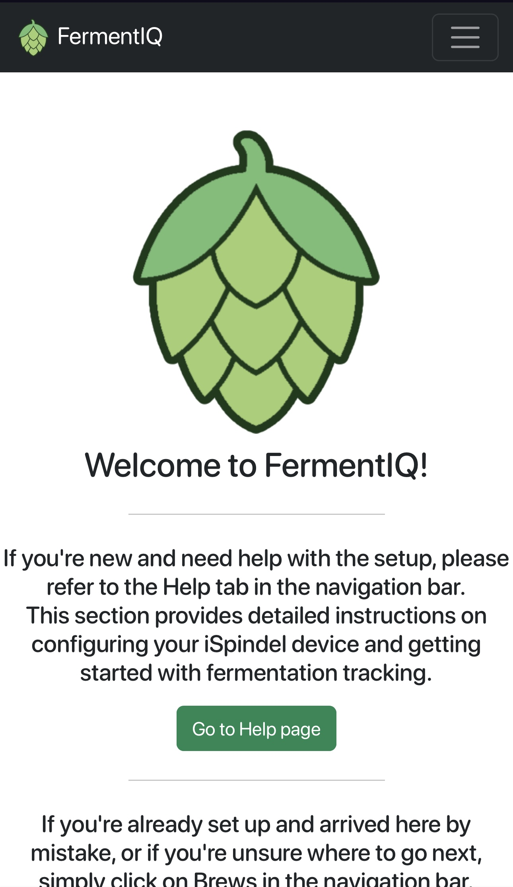
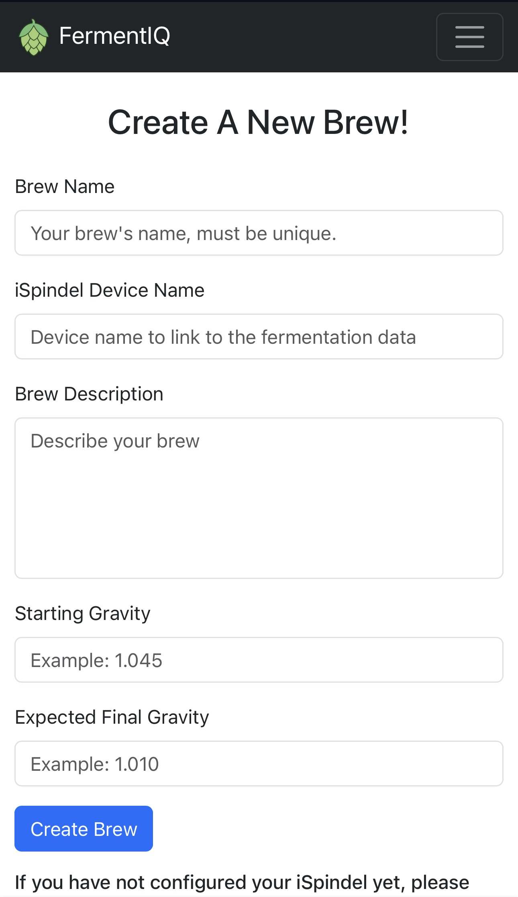
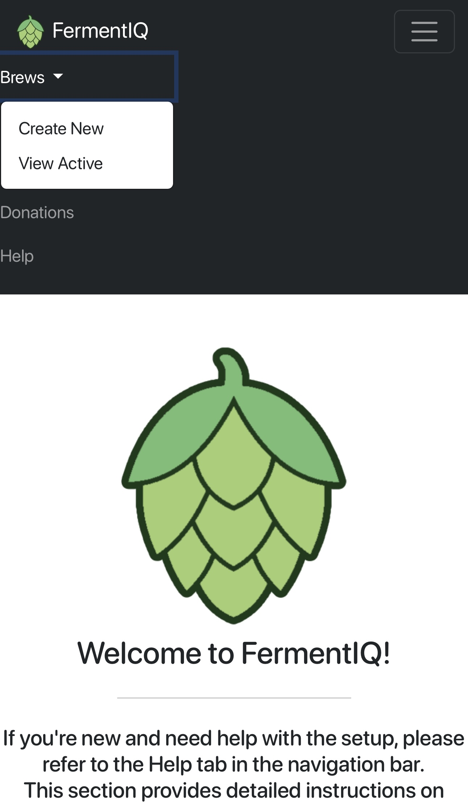
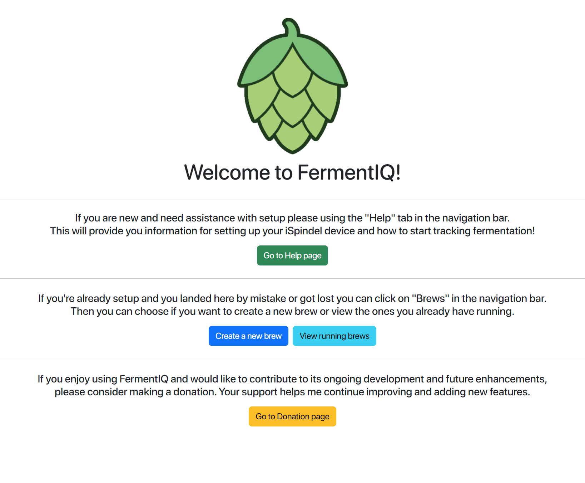
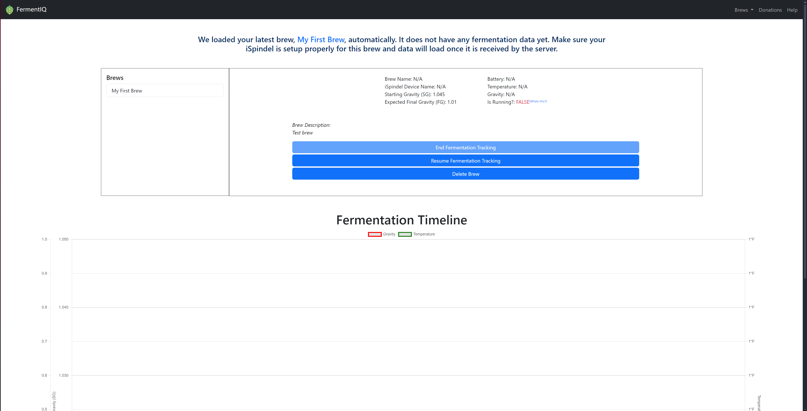
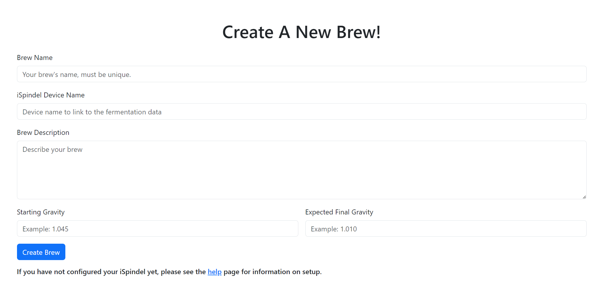

# FermentIQ
A robust and user-friendly application for tracking beer fermentation, featuring both front-end and back-end components. The back-end is powered by Python and PHP, while the front-end leverages HTML, JavaScript, and CSS for a seamless user experience. Utilizing the TCP protocol, the application simplifies integration with devices like iSpindel, enabling easy data transmission to the server where the app is hosted. For setup instructions and system requirements, please refer to the Installation section.

# License
This software is offered under CC BY-NC-ND 4.0, please refer to the license before you redistribute or modify this software.

# Pre-requisites & Installation
To use this software, you will need a web server, which can be hosted on a paid web hosting service, a home server, or even a Raspberry Pi. The server must support both Python and PHP for the back-end functionality. Simply upload the FermentIQ root folder to your web server, and access the application via your browser (e.g., http://localhost:80/FermentIQ/). Detailed instructions for using the application, including configuring your iSpindel, can be found on the "Help" page. For other devices, please consult the respective documentation.

# Responsive
FermentIQ is designed to work seamlessly across all devices—whether you're on desktop, tablet, or mobile. The app automatically adjusts to fit your screen, ensuring a comfortable and intuitive experience no matter where you track your beer's fermentation.

# Simplicity
Setting up is as easy as dragging and dropping the root files onto your web server, then starting the TCP server with the intuitive user interface provided.

# Scalability
Easily track multiple brews and connect multiple devices simultaneously. The system supports up to 100 concurrent connection requests, ensuring seamless performance even with high usage.

# Intuitive
Set up your brews and start tracking your fermentation effortlessly. No API keys or complex configurations required—just upload the files to your web server and access the app through your browser for a quick and straightforward setup. Get started in under 15 minutes!

